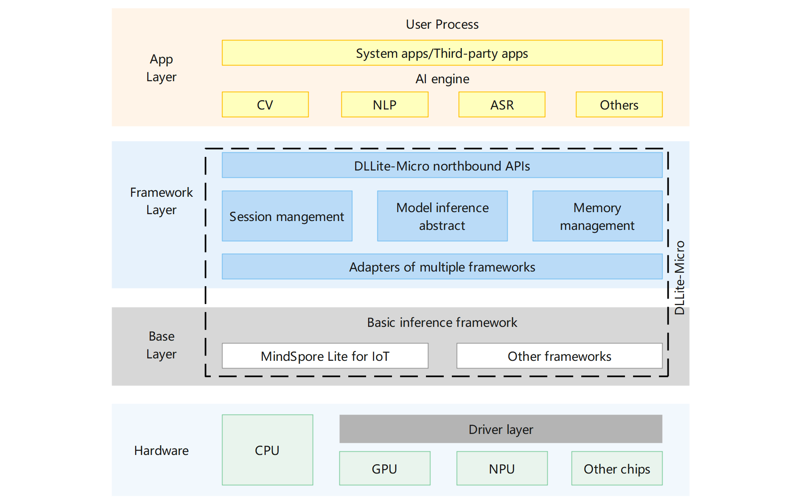

# SIG_DLLite-Micro
English | [简体中文](./README_zh.md)

Note: The content of this SIG follows the convention described in OpenHarmony's PMC Management Charter [README](https://gitee.com/openharmony/community/blob/master/zh/pmc.md).

## SIG group work objectives and scope

### work goals
DLLite-Micro is a lightweight artificial intelligence \(AI\) inference framework that supports deep learning model inference on mini and small devices running OpenHarmony. DLLite-Micro provides you with clear and easy-to-use northbound APIs, helping you deploy deep learning models on the device side more easily. It can work with a variety of basic inference frameworks that are deployable on different types of underlying hardware. Currently, DLLite-Micro only adapts to the MindSpore Lite for IoT inference framework. More basic inference frameworks will be supported in the future.  

### work scope
- Model Inference
Take model from the user. Finish model loading, invoking and unloading when user go through the procedure precisely.
- Sample Project
Create sample project of basic application, providing reference to the developers.
- Ecosystem Expansion
Open-source the framework factory module, and guide third-party manufacturers adpating their devices and chips to DLLite-Micro.

### The repository 
- project name:
  - DLLite-Micro: https://gitee.com/openharmony-sig/dllite_micro


## SIG Members

### Leader
- @SilenChen(https://gitee.com/silenchen)

### Committers
- @ArmyLee0(https://gitee.com/armylee0)

 ### Meetings
 - Meeting time：Biweek Monday 19:00, UTC+8
 - Meeting link：[slack dllite-micro channel](https://openharmonyworkspace.slack.com/archives/C022T41JN68)
 - Meeting notes: [Archive address](https://gitee.com/openharmony-sig/sig-content)

### Contact (optional)

- Mailing list：dev@openharmony.io
- Slack group：[dllite-micro](https://openharmonyworkspace.slack.com/archives/C022T41JN68)

***

# DLLite-Micro<a name="EN-US_TOPIC_0000001101479158"></a>

-   [Introduction](#section11660541593)
-   [Directory Structure](#section161941989596)
-   [Application Scenario](#section989913574441)
-   [Development Procedure](#section83615381480)
-   [Repositories Involved](#section383531114917)

## Introduction<a name="section11660541593"></a>

DLLite-Micro is a lightweight artificial intelligence \(AI\) inference framework that supports deep learning model inference on mini and small devices running OpenHarmony. DLLite-Micro provides you with clear and easy-to-use northbound APIs, helping you deploy deep learning models on the device side more easily. It can work with a variety of basic inference frameworks that are deployable on different types of underlying hardware. Currently, DLLite-Micro only adapts to the MindSpore Lite for IoT inference framework. More basic inference frameworks will be supported in the future. 

**Figure  1**  DLLite-Micro framework architecture<a name="fig4460722185514"></a>  




## Directory Structure<a name="section161941989596"></a>

```
/foundation/ai/dllite-micro           # Main directory of the DLLite-Micro framework
├── interfaces
│   └── kits
│       └── interpreter               # DLLite-Micro external interfaces
├── samples                           # DLLite-Micro application demo
│   ├── app                           # Application samples
│   └── model                         # Model compilation samples
├── services
│   ├── inferframework                # Basic inference framework adaptation module
│   ├── interpreter                   # Basic inference module
│   └── third_party                   # Third-party dependencies
│       └── mindspore_lite            # MindSpore Lite dependencies
├── test                              # Module test
│    └── unittest                     # Unit test
│        └── common                   # Common cases
```

## Application Scenario<a name="section989913574441"></a>

**Supported language:** C++

**Operating system:** OpenHarmony

**Architecture differences:** The code conversion tool provided by MindSpore Lite combines the model structure and weight on the ARM32M platform and does not generate a separate weight file. Therefore, if you are using the ARM32M platform, DLLite-Micro reads the model by combining the model structure and weight, and you need to set  **ModelConfig.weightSeparateFlag\_**  to  **false**. If you are using the ARM32A platform, DLLite-Micro reads the model by separating the model structure from the weight, and you need to set  **ModelConfig.weightSeparateFlag\_**  to  **true**.

## Inferface

[DLLite-Micro inferface](./interfaces/kits/README.md)

## Development Procedure<a name="section83615381480"></a>

1.  **Build the DLLite-Micro framework.**

    For the lightweight AI inference engine framework module, the source code is stored in  **/foundation/ai/dllite\_micro/services**.

    The build commands are as follows:

    **Set the build path.**

    ```
    hb set -root dir // root directory of OpenHarmony
    ```

    **Specify a product for building.** \(Select a product with arrow keys and press  **Enter**.\)

    ```
    hb set -p
    ```

    **Add DLLite-Micro component**

    Add the configuration of the DLLite-Micro component to the /build/lite/components/ai.json file. The sample code below shows some configurations defined in the ai.json file, and the code between ##start## and ##end## is the new configuration (Delete the rows where ##start## and ##end## are located after the configurations are added.)
    ```
    {
      "components": [
        {
          "component": "ai_engine",
          "description": "AI engine framework.",
          "optional": "true",
          "dirs": [
            "foundation/ai/engine"
          ],
          "targets": [
            "//foundation/ai/engine/services:ai"
          ],
          "rom": "130KB",
          "ram": "~337KB",
          "output": [
            "ai_server",
            "ai_communication_adapter.a"
          ],
          "adapted_kernel": [
            "liteos_a",
            "linux"
          ],
          "features": [],
          "deps": {
            "third_party": [
              "bounds_checking_function",
              "iniparser"
            ],
            "kernel_special": {},
            "board_special": {},
            "components": [
              "hilog",
              "utils_base",
              "ipc_lite",
              "samgr_lite"
            ]
          }
        },
    ##start##
        {
          "component": "ai_dllite_micro",
          "description": "DLLite-micro framework.",
          "optional": "true",
          "dirs": [
            "foundation/ai/dllite_micro"
          ],
          "targets": [
            "//foundation/ai/dllite_micro/services:ai_dllite_micro",
          ],
          "rom": "",
          "ram": "",
          "output": [
            "libdlliteclient.so",
            "libdlliteclient_mslite_for_iot.so"
          ],
          "adapted_kernel": ["liteos_a"],
          "features": [],
          "deps": {
            "third_party": [],
            "components": []
          }
        }
    ##end##
      ]
    }
    ```
    **Modify the board configuration file.**

    Add the DLLite-Micro component to the vendor/hisilicon/hispark_taurus/config.json file. The sample code below shows the configurations of the ai subsystem, and the code between ##start## and ##end## is the new configuration (Delete the rows where ##start## and ##end## are located after the configurations are added.)
    ```
        {
          "subsystem": "ai",
          "components": [
            { "component": "ai_engine", "features":[] },
    ##start##
            { "component": "ai_dllite_micro", "features": [] }
    ##end##
          ]
        },
    ```

    **Start building.**

    ```
    hb build -f // Build the entire repository.
    Or hb build dllite_micro // Build only the dllite_micro component.
    ```

    Note: For details about how to set up the system environment, see  [OpenHarmony Quick Start](https://gitee.com/openharmony/docs/blob/master/en/device-dev/quick-start/Readme-EN.md). For details about how to install and use the  **hb**  utility, see the  [Lightweight Building Component](https://gitee.com/openharmony/build_lite/blob/master/README.md).

2.  Compile a model.

    Currently, the framework only supports loading the inference model that is compiled into a dynamic library. You need to compile the model dynamic library in a specific mode based on the basic framework in use. The following describes the model compilation processes of different frameworks.

    MindSpore 1.2 framework model compilation:

    For details about how to use the MindSpore 1.2 framework for inference, see the sample provided in  **/foundation/ai/dllite\_micro/samples/model/mnist**. The following is the directory for compiling the model:

    ```
    /dllite_micro/samples/model/mnist    # Sample for compilation of the MNIST classification model
    ├── include                          # Header files
    │   ├── nnacl                        # Header file of nnacl operators
    │   ├── wrapper
    │   └── mindspore_adapter.h
    ├── lib                              # Dependent library files
    │   ├── libmindspore-lite.a          # MindSpore Lite operator library
    │   └── libwrapper.a                 # MindSpore Lite API library
    ├── src                              # Source files
    │   ├── micro                        # Inference source code generated by the codegen tool
    │   └── mindspore_adapter.cpp        # MindSpore Lite adapter that provides external APIs
    └── BUILD.gn                         # GN configuration file
    ```

    1.  Download the MindSpore Lite software package of the desired version from the  [MindSpore open source website](https://www.mindspore.cn/tutorial/lite/en/r1.2/use/downloads.html#id1).
    2.  For a model not under the MindSpore framework, you need to use the converter provided in the software package to convert the original model into an MS model. For details about how to use the converter, see  [Converting Models for Inference](https://www.mindspore.cn/tutorial/lite/en/r1.2/use/converter_tool.html).
    3.  Use codegen to convert the MS model into the model code in C or C++ format. The model code is generated in the  **src**  directory. Copy the model code in the  **src**  directory to the  **/foundation/ai/dllite\_micro/samples/model/mnist/src/micro**  directory.
    4.  Rename the  **model.h**  file in the  **/foundation/ai/dllite\_micro/samples/model/mnist/src/micro**  directory as  **mmodel.h**. In addition, change  **\#include"model.h"**  in the  **session.cc**  file into  **\#include"mmodel.h"**  to avoid confusion with  **/foundation/ai/dllite\_micro/services/third\_party/mindspore\_lite/include/model.h**.

        > **NOTICE:** 
        >Copy the  **net.bin**  model weight file in the  **src**  directory. The model weight file needs to be loaded for inference in subsequent steps.

    5.  Download the OpenHarmony software package corresponding to MindSpore r1.2, obtain the operator library and API library \(**inference/lib/libmindspore-lite.a**  and  **tools/lib/libwrapper.a**\), and copy them to the  **/foundation/ai/dllite\_micro/samples/model/mnist/lib**  directory.
    6.  Copy the inference framework header files \(**tools/codegen/nnacl/ and tools/codegen/wrapper/**\) in the MindSpore Lite software package to the  **/foundation/ai/dllite\_micro/samples/model/mnist/include**  directory.
    7.  Modify the  **/build/lite/component/ai.json**  file and add the model compilation configuration. The following is a code segment of the  **ai.json**  file: The content between  **\#\#start\#\#**  and  **\#\#end\#\#**  is the new configuration. \(**\#\#start\#\#**  and  **\#\#end\#\#**  are only used to identify the positions. After the configuration is added, delete the two lines.\)

    ```
        {
          "component": "ai_dllite_micro",
          "description": "DLLite-Micro framework.",
          "optional": "true",      
          "dirs": [
            "foundation/ai/dllite_micro"
          ],
          "targets": [
            "//foundation/ai/dllite_micro/services:ai_dllite_micro",
        ##start##
            "//foundation/ai/dllite_micro/samples:dllite_micro_sample_model"
        ##end##
          ],
          "rom": "",
          "ram": "",
          "output": [
            "libdlliteclient.so",
            "libdlliteclient_mslite_for_iot.so"
          ],
          "adapted_kernel": [ "liteos_a" ],
          "features": [],
          "deps": {
            "components": [],
            "third_party": []
          }
        },
    ```

    8.  Compile DLLite-Micro. The generated model dynamic library is stored in  **/usr/lib/libmnist.so**.

        > **NOTE:** 
        >For details about how to download and use the MindSpore model converter and codegen tools, go to the  [MindSpore open source website](https://www.mindspore.cn/tutorial/lite/en/r1.2/use/downloads.html#id1).


3.  Develop samples. \(For details, see the MNIST classification demo.\)

    The  **/foundation/ai/dllite-micro/samples/app/mnist**  directory provides a sample application to call the API provided by DLLite-Micro to load the model dynamic library and model weight for inference.

    Creating an instance:

    ```
    static int CreatInterpreter()
    {
        // RegisterFeature
        g_featureConfig.featureName = FEATURE_NAME;
        featureInterpreter = FeatureInterpreter::RegisterFeature(featureConfig);
        if (featureInterpreter.get() == nullptr) {
            std::cout << "RegisterFeature failed" << std::endl;
            return -1;
        }
    
        // CreateModelInterpreter
        modelConfig.inferFrameworkType_ = InferFrameworkType::MINDSPORE;
        modelInterpreter = featureInterpreter->CreateModelInterpreter(modelConfig);
        if (modelInterpreter == nullptr) {
            std::cout << "CreateModelInterpreter failed" << std::endl;
            return -1;
        }
        return 0;
    }
    ```

    Calling the inference process:

    ```
    static int ModelInference()
    {
        // Load
        ReturnCode returnCode = modelInterpreter->Load();
        if (returnCode != ReturnCode::SUCCESS) {
            std::cout << "Load failed" << std::endl;
            return -1;
        }
    
        // GetTensors
        returnCode = modelInterpreter->GetTensors(inputs, IOFlag::INPUT);
        if (returnCode != ReturnCode::SUCCESS) {
            std::cout << "GetTensors inputs failed" << std::endl;
            return -1;
        }
        returnCode = modelInterpreter->GetTensors(outputs, IOFlag::OUTPUT);
        if (returnCode != ReturnCode::SUCCESS) {
            std::cout << "GetTensors outputs failed" << std::endl;
            return -1;
        }
        SetInputTensor(inputs);
    
        // Invoke
        WarmUp(modelInterpreter);
        for (int i = 0; i < INVOKE_LOOP_COUNT; ++i) {
            returnCode = modelInterpreter->Invoke(inputs, outputs);
            if (returnCode != ReturnCode::SUCCESS) {
                std::cout << Invoke failed" << std::endl;
                return -1;
            }
        }
        
        returnCode = modelInterpreter->GetTensors(outputs, IOFlag::OUTPUT);
        PrintTensors(inputs, outputs);
    
        // Unload
        returnCode = modelInterpreter->Unload();
        if (returnCode != ReturnCode::SUCCESS) {
            std::cout << "Unload failed" << std::endl;
            return -1;
        }
    
        return 0;
    }
    ```

    Destroying the instance:

    ```
    static int DestoryInterpreter()
    {
        // DestroyModelInterpreter
        ReturnCode returnCode = featureInterpreter->DestroyModelInterpreter(modelInterpreter);
        if (returnCode != ReturnCode::SUCCESS) {
            std::cout << "DestroyModelInterpreter failed" << std::endl;
            return -1;
        }
    
        // UnregisterFeature
        returnCode = FeatureInterpreter::UnregisterFeature(featureInterpreter);
        if (returnCode != ReturnCode::SUCCESS) {
            std::cout << "UnregisterFeature failed" << std::endl;
            return -1;
        }
    
        return 0;
    }
    ```

    Compiling the sample application:

    As shown below, add the  **dllite\_micro\_sample**  configuration to the  **ai.json**  file. \(**\#\#start\#\#**  and  **\#\#end\#\#**  are only used to identify the positions. After the configuration is added, delete the two lines.\)

    ```
        {
          "component": "ai_dllite_micro",
          "description": "DLLite-Micro framework.",
          "optional": "true",      
          "dirs": [
            "foundation/ai/dllite_micro"
          ],
          "targets": [
            "//foundation/ai/dllite_micro/services:ai_dllite_micro",
            "//foundation/ai/dllite_micro/samples:dllite_micro_sample_model",
        ##start##
            "//foundation/ai/dllite_micro/samples:dllite_micro_sample"
        ##end##
          ],
          "rom": "",
          "ram": "",
          "output": [
            "libdlliteclient.so",
            "libdlliteclient_mslite_for_iot.so"
          ],
          "adapted_kernel": [ "liteos_a" ],
          "features": [],
          "deps": {
            "components": [],
            "third_party": []
          }
        },
    ```

    The sample application requires the model dynamic library and model weight files. Add the following commands to  **/foundation/ai/dllite-micro/samples/app/mnist/BUILD.gn**. During compilation, copy the model weight file generated by MindSpore Lite to the  **/storage/data/**  directory of OpenHarmony.

    ```
    copy("sample_model") {
      sources = ["//foundation/ai/dllite_micro/samples/model/mnist/src/micro/net.bin"]
      outputs = ["$root_out_dir/data/dllite_micro_mnist.bin"]
    }
    ```

    Compile DLLite-Micro. The sample application generated after compilation is stored in  **/bin/dllite\_micro\_mnist\_sample.bin**. Run the following command on OpenHarmony to run the application:

    ```
    cd /bin
    ./dllite_micro_mnist_sample.bin /usr/lib/libmnist.so /storage/data/dllite_micro_mnist.bin
    ```


## Repositories Involved<a name="section383531114917"></a>

-   [ai\_engine](https://gitee.com/openharmony/ai_engine)
-   [build\_lite](https://gitee.com/openharmony/build_lite/blob/master/README_zh.md)
-   [hiviewdfx\_hilog\_lite](https://gitee.com/openharmony/hiviewdfx_hilog_lite)
-   [utils\_native\_lite](https://gitee.com/openharmony/)
-   [mindspore](https://gitee.com/mindspore/mindspore)
