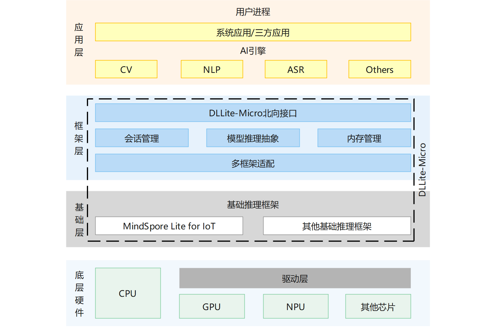

# SIG-DLLite-Micro
简体中文 | [English](./README.md)

说明：本SIG的内容遵循OpenHarmony的PMC管理章程 [README](https://gitee.com/openharmony/community/blob/master/zh/pmc.md)中描述的约定。

## SIG组工作目标和范围

### 工作目标
DLLite-Micro是一个轻量级的AI推理框架，支持在运行OpenHarmony OS的轻量设备和小型设备上实现深度模型的推理。DLLite-Micro向开发者提供清晰、易上手的北向接口，降低开发者在端侧部署深度模型的难度；可对接多种基础推理框架，而基础推理框架则可对接不同的底层硬件。当前，DLLite-Micro仅适配了MindSpore Lite for IoT推理框架，后续会逐步增加其他的基础推理框架，开发者可以按需配置。

### 工作范围
- 模型推理功能
接收用户传入的模型，在用户的正确调用下完成模型的加载，执行和卸载等操作；
- 样例工程
创建基础业务的样例工程，供开发者用户参考
- 生态拓展
开源框架工厂模块，指导三方设备厂商、芯片厂商对接框架

## 代码仓
- 代码仓地址：
  - DLLite-Micro: https://gitee.com/openharmony-sig/dllite_micro

## SIG组成员

### Leader
- @SilenChen(https://gitee.com/silenchen)

### Committers列表
- @ArmyLee0(https://gitee.com/armylee0)

### 会议
 - 会议时间：双周例会，周一晚上19:00, UTC+8
 - 会议链接：[slack dllite-micro频道](https://openharmonyworkspace.slack.com/archives/C022T41JN68)
 - 会议纪要：[归档链接地址](https://gitee.com/openharmony-sig/sig-content)

### 联系方式(可选)

- 邮件列表：dev@openharmony.io
- Slack群组：[dllite-micro](https://openharmonyworkspace.slack.com/archives/C022T41JN68)

***

# AI业务子系统·DLLite-Micro<a name="ZH-CN_TOPIC_0000001101479158"></a>

-   [简介](#section11660541593)
-   [目录](#section161941989596)
-   [使用场景](#section989913574441)
-   [开发步骤](#section83615381480)
-   [涉及仓](#section383531114917)

## 简介<a name="section11660541593"></a>

DLLite-Micro是一个轻量级的AI推理框架，支持在运行OpenHarmony OS的轻量设备和小型设备上实现深度模型的推理。DLLite-Micro向开发者提供清晰、易上手的北向接口，降低开发者在端侧部署深度学习模型的难度；可对接多种基础推理框架，而基础推理框架则可对接不同的底层硬件。当前，DLLite-Micro仅适配了MindSpore Lite for IoT推理框架，后续会逐步增加其他的基础推理框架，开发者可以按需配置。

**图 1**  DLLite-Micro框架架构图<a name="fig4460722185514"></a>  




## 目录<a name="section161941989596"></a>

```
/foundation/ai/dllite-micro           # DLLite-Micro框架主目录
├── interfaces
│   └── kits
│       └── interpreter               # DLLite-micro对外接口
├── samples                           # DLLite-micro应用案例demo
│   ├── app                           # app samples目录
│   └── model                         # 模型编译samples目录
├── services
│   ├── inferframework                # 基础推理框架适配模块
│   ├── interpreter                   # 基础推理模块
│   └── third_party                   # 第三方依赖
│       └── mindspore_lite            # mindspore_lite依赖
├── test                              # 模块测试目录
│    └── unittest                     # 单元测试
│        └── common                   # 公共用例
```

## 使用场景<a name="section989913574441"></a>

**支持语言：** C++语言

**操作系统限制：** OpenHarmony操作系统

**架构差异：** 由于MindSpore Lite提供的代码转换工具在ARM32M平台将模型结构和权重合并，不单独生成权重文件，在ARM32M架构平台上，DLLite-micro采用模型结构和权重合并的方式读取模型，ModelConfig.weightSeparateFlag\_需要设为false；在ARM32A架构平台，DLLite-micro采用模型结构和权重分离的形式读取模型，ModelConfig.weightSeparateFlag\_需要设为true。

## 对外接口

[DLLite-Micro对外接口](./interfaces/kits/README_zh.md)

## 开发步骤<a name="section83615381480"></a>

1.  **DLLite-Micro框架编译**

    轻量级AI推理引擎框架模块，源代码所在路径：/foundation/ai/dllite\_micro/services

    编译指令如下：

    **设置编译路径**

    ```
    hb set -root dir //OpenHarmony根目录
    ```

    **设置编译产品**（执行后用方向键和回车进行选择）：

    ```
    hb set -p
    ```

    **添加DLLite-Micro组件**

    修改文件/build/lite/components/ai.json，添加DLLite-Micro的配置，如下所示为ai.json文件片段，"\#\#start\#\#"和"\#\#end\#\#"之间为新增配置（"\#\#start\#\#"和"\#\#end\#\#"仅用来标识位置，添加完配置后删除这两行）：
    ```
    {
      "components": [
        {
          "component": "ai_engine",
          "description": "AI engine framework.",
          "optional": "true",
          "dirs": [
            "foundation/ai/engine"
          ],
          "targets": [
            "//foundation/ai/engine/services:ai"
          ],
          "rom": "130KB",
          "ram": "~337KB",
          "output": [
            "ai_server",
            "ai_communication_adapter.a"
          ],
          "adapted_kernel": [
            "liteos_a",
            "linux"
          ],
          "features": [],
          "deps": {
            "third_party": [
              "bounds_checking_function",
              "iniparser"
            ],
            "kernel_special": {},
            "board_special": {},
            "components": [
              "hilog",
              "utils_base",
              "ipc_lite",
              "samgr_lite"
            ]
          }
        },
    ##start##
        {
          "component": "ai_dllite_micro",
          "description": "DLLite-micro framework.",
          "optional": "true",
          "dirs": [
            "foundation/ai/dllite_micro"
          ],
          "targets": [
            "//foundation/ai/dllite_micro/services:ai_dllite_micro"
          ],
          "rom": "",
          "ram": "",
          "output": [
            "libdlliteclient.so",
            "libdlliteclient_mslite_for_iot.so"
          ],
          "adapted_kernel": ["liteos_a"],
          "features": [],
          "deps": {
            "third_party": [],
            "components": []
          }
        }
    ##end##
      ]
    }
    ```

    **修改单板配置文件**

    修改文件vendor/hisilicon/hispark_taurus/config.json，新增DLLite-Micro组件的条目，如下所示代码片段为ai子系统配置，"##start##"和"##end##"之间为新增条目（"##start##"和"##end##"仅用来标识位置，添加完配置后删除这两行）：
    ```
        {
          "subsystem": "ai",
          "components": [
            { "component": "ai_engine", "features":[] },
    ##start##
            { "component": "ai_dllite_micro", "features": [] }
    ##end##
          ]
        },
    ```

    **执行编译**：

    ```
    hb build -f //编译全仓
    或者 hb build dllite_micro //只编译dllite_micro组件
    ```

    **注意**：系统环境搭建请参考  [OpenHarmony快速入门](https://gitee.com/openharmony/docs/blob/master/zh-cn/device-dev/quick-start/Readme-CN.md)；hb工具安装和使用指导请参考  [轻量级编译构建组件](https://gitee.com/openharmony/build_lite/blob/master/README_zh.md)

2.  **模型编译**

    当前框架仅支持加载编译成动态库的推理模型，用户需要根据不同的基础框架按照特定的方式编译模型动态库，下面将介绍不同框架的模型编译过程。

    **MindSpore 1.2框架模型编译：**

    使用MindSpore 1.2框架进行推理可以参考/foundation/ai/dllite\_micro/samples/model/mnist提供的样例，编译模型的目录参考如下：

    ```
    /dllite_micro/samples/model/mnist    # Mnist分类模型编译示例目录
    ├── include                          # 头文件目录
    │   ├── nnacl                        # nnacl算子头文件
    │   ├── wrapper
    │   └── mindspore_adapter.h
    ├── lib                              # 依赖库文件目录
    │   ├── libmindspore-lite.a          # MindSpore Lite算子库
    │   └── libwrapper.a                 # MindSpore Lite接口库
    ├── src                              # 源文件目录
    │   ├── micro                        # 通过codegen工具生成的推理源代码
    │   └── mindspore_adapter.cpp        # 封装MindSpore Lite，提供对外接口
    └── BUILD.gn                         # GN配置文件
    ```

    1.  首先从[MindSpore开源网站](https://www.mindspore.cn/tutorial/lite/zh-CN/r1.2/use/downloads.html#id1)获取对应版本软件包（根据具体使用环境下载相应版本的软件包）；
    2.  非Mindspore框架的模型需要用软件包内提供的converter工具将原始模型转换为ms格式模型，ms格式的模型可以跳过这一步，converter的使用请参考[推理模型转换](https://www.mindspore.cn/tutorial/lite/zh-CN/r1.2/use/converter_tool.html)；
    3.  使用codegen将ms模型转换成C/C++格式模型代码，模型代码生成在src目录下，将src目录下的模型代码拷贝到/foundation/ai/dllite\_micro/samples/model/mnist/src/micro目录下；
    4.  将/foundation/ai/dllite\_micro/samples/model/mnist/src/micro目录下的model.h文件名修改为mmodel.h，同时将session.cc文件中的\#include"model.h"修改为\#include"mmodel.h"，避免和/foundation/ai/dllite\_micro/services/third\_party/mindspore\_lite/include/model.h混淆；

        > **须知：** 
        >请同步拷贝src目录下的net.bin模型权重，后续步骤需要加载模型权重进行推理。

    5.  下载MindSpore r1.2对应OpenHarmony的软件包，取出算子库和接口库（inference/lib/libmindspore-lite.a和tools/lib/libwrapper.a）拷贝到/foundation/ai/dllite\_micro/samples/model/mnist/lib目录下；
    6.  将MindSpore Lite软件包中的推理框架头文件（tools/codegen/nnacl/和tools/codegen/wrapper/）拷贝到/foundation/ai/dllite\_micro/samples/model/mnist/include目录下；
    7.  修改/build/lite/component/ai.json，添加模型编译的配置，如下所示为ai.json文件片段，"\#\#start\#\#"和"\#\#end\#\#"之间为新增配置（"\#\#start\#\#"和"\#\#end\#\#"仅用来标识位置，添加完配置后删除这两行）：

    ```
        {
          "component": "ai_dllite_micro",
          "description": "DLLite-Micro framework.",
          "optional": "true",      
          "dirs": [
            "foundation/ai/dllite_micro"
          ],
          "targets": [
            "//foundation/ai/dllite_micro/services:ai_dllite_micro",
        ##start##
            "//foundation/ai/dllite_micro/samples:dllite_micro_sample_model"
        ##end##
          ],
          "rom": "",
          "ram": "",
          "output": [
            "libdlliteclient.so",
            "libdlliteclient_mslite_for_iot.so"
          ],
          "adapted_kernel": [ "liteos_a" ],
          "features": [],
          "deps": {
            "components": [],
            "third_party": []
          }
        },
    ```

    8.  编译dllite-micro，编译生成的模型动态库在/usr/lib/libmnist.so；

        > **说明：** 
        >MindSpore模型转换工具和代码生成工具下载和使用详见[MindSpore开源网站](https://www.mindspore.cn/tutorial/lite/zh-CN/r1.2/index.html)。


3.  **sample开发**（参考MNIST分类demo）

    /foundation/ai/dllite-micro/samples/app/mnist目录中提供了样例程序调用dllite-micro提供接口，加载模型动态库和模型权重进行模型推理。

    **创建实例**

    ```
    static int CreatInterpreter()
    {
        // RegisterFeature
        g_featureConfig.featureName = FEATURE_NAME;
        featureInterpreter = FeatureInterpreter::RegisterFeature(featureConfig);
        if (featureInterpreter.get() == nullptr) {
            std::cout << "RegisterFeature failed" << std::endl;
            return -1;
        }
    
        // CreateModelInterpreter
        modelConfig.inferFrameworkType_ = InferFrameworkType::MINDSPORE;
        modelInterpreter = featureInterpreter->CreateModelInterpreter(modelConfig);
        if (modelInterpreter == nullptr) {
            std::cout << "CreateModelInterpreter failed" << std::endl;
            return -1;
        }
        return 0;
    }
    ```

    **调用推理流程**

    ```
    static int ModelInference()
    {
        // Load
        ReturnCode returnCode = modelInterpreter->Load();
        if (returnCode != ReturnCode::SUCCESS) {
            std::cout << "Load failed" << std::endl;
            return -1;
        }
    
        // GetTensors
        returnCode = modelInterpreter->GetTensors(inputs, IOFlag::INPUT);
        if (returnCode != ReturnCode::SUCCESS) {
            std::cout << "GetTensors inputs failed" << std::endl;
            return -1;
        }
        returnCode = modelInterpreter->GetTensors(outputs, IOFlag::OUTPUT);
        if (returnCode != ReturnCode::SUCCESS) {
            std::cout << "GetTensors outputs failed" << std::endl;
            return -1;
        }
        SetInputTensor(inputs);
    
        // Invoke
        WarmUp(modelInterpreter);
        for (int i = 0; i < INVOKE_LOOP_COUNT; ++i) {
            returnCode = modelInterpreter->Invoke(inputs, outputs);
            if (returnCode != ReturnCode::SUCCESS) {
                std::cout << Invoke failed" << std::endl;
                return -1;
            }
        }
        
        returnCode = modelInterpreter->GetTensors(outputs, IOFlag::OUTPUT);
        PrintTensors(inputs, outputs);
    
        // Unload
        returnCode = modelInterpreter->Unload();
        if (returnCode != ReturnCode::SUCCESS) {
            std::cout << "Unload failed" << std::endl;
            return -1;
        }
    
        return 0;
    }
    ```

    **销毁实例**

    ```
    static int DestoryInterpreter()
    {
        // DestroyModelInterpreter
        ReturnCode returnCode = featureInterpreter->DestroyModelInterpreter(modelInterpreter);
        if (returnCode != ReturnCode::SUCCESS) {
            std::cout << "DestroyModelInterpreter failed" << std::endl;
            return -1;
        }
    
        // UnregisterFeature
        returnCode = FeatureInterpreter::UnregisterFeature(featureInterpreter);
        if (returnCode != ReturnCode::SUCCESS) {
            std::cout << "UnregisterFeature failed" << std::endl;
            return -1;
        }
    
        return 0;
    }
    ```

    **编译样例程序**

    如下图所示，在ai.json中添加dllite\_micro\_sample的配置（"\#\#start\#\#"和"\#\#end\#\#"仅用来标识位置，添加完配置后删除这两行）：

    ```
        {
          "component": "ai_dllite_micro",
          "description": "DLLite-Micro framework.",
          "optional": "true",      
          "dirs": [
            "foundation/ai/dllite_micro"
          ],
          "targets": [
            "//foundation/ai/dllite_micro/services:ai_dllite_micro",
            "//foundation/ai/dllite_micro/samples:dllite_micro_sample_model",
        ##start##
            "//foundation/ai/dllite_micro/samples:dllite_micro_sample"
        ##end##
          ],
          "rom": "",
          "ram": "",
          "output": [
            "libdlliteclient.so",
            "libdlliteclient_mslite_for_iot.so"
          ],
          "adapted_kernel": [ "liteos_a" ],
          "features": [],
          "deps": {
            "components": [],
            "third_party": []
          }
        },
    ```

    样例程序需要模型动态库和模型权重两个文件，在/foundation/ai/dllite-micro/samples/app/mnist/BUILD.gn添加如下命令，编译时将MindSpore Lite生成的模型权重文件拷贝到OpenHarmony系统/storage/data/目录下。

    ```
    copy("sample_model") {
      sources = ["//foundation/ai/dllite_micro/samples/model/mnist/src/micro/net.bin"]
      outputs = ["$root_out_dir/data/dllite_micro_mnist.bin"]
    }
    ```

    编译dllite-micro组件，编译生成的样例程序在/bin/dllite\_micro\_mnist\_sample.bin，在OpenHarmony系统中执行以下命令，运行应用程序：

    ```
    cd /bin
    ./dllite_micro_mnist_sample.bin /usr/lib/libmnist.so /storage/data/dllite_micro_mnist.bin
    ```


## 涉及仓<a name="section383531114917"></a>

-   [ai\_engine](https://gitee.com/openharmony/ai_engine)
-   [build\_lite](https://gitee.com/openharmony/build_lite/blob/master/README_zh.md)
-   [hiviewdfx\_hilog\_lite](https://gitee.com/openharmony/hiviewdfx_hilog_lite)
-   [utils\_native\_lite](https://gitee.com/openharmony/)
-   [mindspore](https://gitee.com/mindspore/mindspore)
